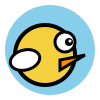

<div align="center">
  
</div>

<h1 align="center">So Called Flappy Bird</h1>

<p align="center">
  <strong>A modern HTML5/React clone of the classic Flappy Bird, supercharged with a Neural Network AI Training Mode!</strong>
</p>

## 🌟 Overview

Welcome to **So Called Flappy Bird**! What started as a simple browser clone has been refactored into a custom-built, lightweight 2D physics engine. The game doesn't just let you play Flappy Bird—it lets you train an artificial intelligence using a Genetic Algorithm to master the game, and then challenge it head-to-head!

<div align="center">
  
</div>

---

## ✨ Key Features

### 🎮 Dual Modes
- **Play Mode**: Classic, infinitely scrolling Flappy Bird action. Just tap, click, or press Space to flap and dodge pipes. You can even toggle **"Compete against Best AI"** to spawn a ghost opponent that races alongside you!
- **Train Mode**: Watch a population of 30 Neural Network-driven birds independently learn to navigate the pipes. The game manages generations, mutations, and crossovers using a custom Genetic Algorithm.

### 🧠 Genetic Algorithm AI
Built from scratch in JavaScript without heavy machine learning libraries. It features:
- **Neural Network**: A `x` inputs, hidden layers, and `y` outputs architecture to process distance gaps.
- **Fitness Tracking**: Birds are evaluated based on how long they survive and how many pipes they clear.
- **Evolution**: The top-performing birds (Elitism) pass down their "genes" (weights) to the next generation, with slight mutations applied to encourage the AI to discover the optimal flight path.

### 📱 Responsive & Mobile Friendly
- **Device Detection**: The game dynamically adjusts its physics (Gravity, Flap Strength, Pipe Speed) based on your device width to ensure it remains a fun and approachable challenge whether you are playing on a giant desktop monitor or a portrait smartphone screen.
- **Touch Controls**: Fully supports touch events ensuring smooth jumps on mobile devices.

### 🎨 Visual Polish
- Procedurally drawn vectors for game sprites.
- Z-Index depth rendering (Clouds → Pipes → Birds).
- Cute bird animations including flapping wings.

---

## 🚀 Getting Started

This game uses **React** + **Vite** for the UI overlays and a vanilla JS custom engine for the canvas loop.

### Installation

1. Make sure you have Node.js installed.
2. Clone or download the repository.
3. Install the dependencies:
   ```bash
   npm install
   ```

### Running Locally

Start the Vite development server:
```bash
npm run dev
```
Then visit `http://localhost:5173` in your browser.

### Building for Production

To create a minified and optimized build of the game:
```bash
npm run build
```
The output will be found in the `dist` folder.

---

## 🛠️ Tech Stack
- **DOM / UI**: React (via Vite)
- **Styling**: Vanilla CSS
- **Game Engine**: Custom HTML5 `<canvas>` JS Engine (`requestAnimationFrame`)
- **AI Math**: `mathjs`
- **SEO & Favicon**: Custom handcrafted SVG loaded via Native Web API.

---

*Built for fun, learning, and seeing how fast an AI can ruin a classic game!*
